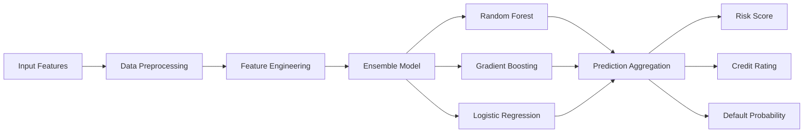
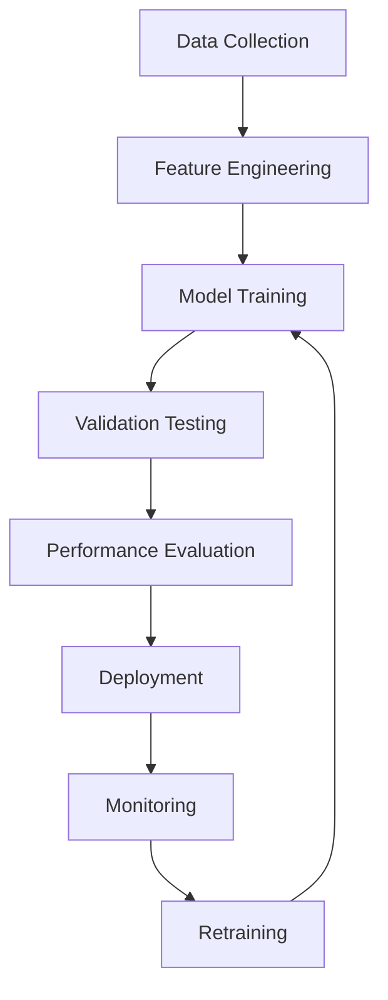

# CrediXpert - Advanced Credit Risk Assessment Platform

<div align="center">


**Intelligent credit scoring powered by machine learning**

[](https://credi-xpert.streamlit.app/)
[](https://www.python.org/downloads/)
[](LICENSE)

[🚀 Live Demo](https://credi-xpert.streamlit.app/) | [📖 Documentation](#documentation) | [🎥 Demo Video](#demo-video)

</div>

## 🌟 Overview

CrediXpert is a sophisticated credit risk assessment platform that leverages machine learning algorithms to evaluate loan default probability. Built with modern web technologies and designed for financial institutions, it provides real-time credit scoring with comprehensive risk analysis.

### 🎯 Key Features

- **🤖 AI-Powered Risk Assessment**: Advanced ensemble machine learning models
- **📊 Real-Time Analytics**: Instant credit scoring and risk profiling
- **🎨 Professional Interface**: Modern, responsive design with dark mode support
- **📈 Interactive Visualizations**: Dynamic charts and risk factor analysis
- **🔒 Regulatory Compliant**: Adheres to RBI guidelines and fair lending practices
- **📱 Responsive Design**: Works seamlessly across desktop and mobile devices

## 🚀 Demo Video

[](https://credi-xpert.streamlit.app/)

Experience the full functionality of CrediXpert with our interactive demo at: **https://credi-xpert.streamlit.app/**

## 🏗️ Architecture

### Technology Stack

| Component | Technology | Purpose |
|-----------|------------|---------|
| **Frontend** | Streamlit | Interactive web application |
| **Visualization** | Plotly | Dynamic charts and graphs |
| **Styling** | Custom CSS | Professional UI/UX |
| **ML Framework** | Scikit-learn | Machine learning models |
| **Data Processing** | Pandas, NumPy | Data manipulation |

### Model Architecture



## 📋 Features

### 🔍 Risk Assessment Module
- **Personal Information Analysis**: Age, income, residence type evaluation
- **Loan Characteristics**: Amount, tenure, purpose, and type assessment
- **Credit History Evaluation**: Payment delays, delinquency ratios, utilization analysis
- **Real-Time Calculations**: Loan-to-income ratio, EMI calculations

### 📊 Model Insights Dashboard
- **Performance Metrics**: Accuracy, precision, recall, F1-score, AUC-ROC
- **Feature Importance**: Visual ranking of risk factors
- **Risk Distribution**: Portfolio-level analytics and trends
- **Comparative Analysis**: Benchmark against industry standards

### 📚 Comprehensive Documentation
- **Model Methodology**: Detailed algorithm explanations
- **Risk Interpretation**: Clear guidance on output meanings
- **Regulatory Compliance**: RBI guidelines and fair lending practices
- **API Documentation**: Integration guidelines for developers

## 🚦 Getting Started

### Prerequisites

```bash
Python 3.8+
pip package manager
```

### Installation

1. **Clone the repository**
```bash
git clone https://github.com/yourusername/credixpert.git
cd credixpert
```

2. **Install dependencies**
```bash
pip install -r requirements.txt
```

3. **Run the application**
```bash
streamlit run app.py
```

4. **Access the application**
```
http://localhost:8501
```

### Requirements

```txt
streamlit>=1.28.0
plotly>=5.15.0
pandas>=1.5.3
numpy>=1.24.3
scikit-learn>=1.3.0
```

## 🔧 Configuration

### Environment Variables

```bash
# Model Configuration
MODEL_VERSION=2.1.0
MODEL_PATH=./models/
FEATURE_SCALER=standard

# Application Settings
APP_TITLE="CrediXpert"
DEBUG_MODE=False
CACHE_TTL=3600
```

### Model Parameters

```python
# Risk Thresholds
LOW_RISK_THRESHOLD = 0.05      # 5% default probability
MEDIUM_RISK_THRESHOLD = 0.15   # 15% default probability

# Credit Score Ranges
EXCELLENT_SCORE = 750          # 750-850
GOOD_SCORE = 700              # 700-749
FAIR_SCORE = 650              # 650-699
POOR_SCORE = 600              # 600-649
```

## 📊 Usage Examples

### Basic Risk Assessment

```python
# Input parameters
applicant_data = {
    'age': 28,
    'income': 1200000,
    'loan_amount': 2560000,
    'loan_tenure_months': 36,
    'avg_dpd_per_delinquency': 20,
    'delinquency_ratio': 30,
    'credit_utilization_ratio': 30,
    'num_open_accounts': 2,
    'residence_type': 'Owned',
    'loan_purpose': 'Home',
    'loan_type': 'Secured'
}

# Get risk assessment
probability, credit_score, rating = predict(**applicant_data)
```

### API Integration

```python
import requests

url = "https://api.credixpert.com/v1/assess"
headers = {"Authorization": "Bearer YOUR_API_KEY"}

response = requests.post(url, json=applicant_data, headers=headers)
risk_assessment = response.json()
```

## 🎨 User Interface

### Dashboard Components

| Component | Description | Features |
|-----------|-------------|----------|
| **Input Form** | Applicant data collection | Organized sections, validation, help tooltips |
| **Quick Metrics** | Real-time calculations | Loan ratios, EMI calculations, risk indicators |
| **Results Display** | Risk assessment output | Color-coded scores, visual indicators |
| **Analytics Charts** | Risk factor visualization | Radar charts, distribution plots |

### Responsive Design

- ✅ **Desktop**: Full-featured dashboard with side panels
- ✅ **Tablet**: Optimized layout with collapsible sections
- ✅ **Mobile**: Touch-friendly interface with simplified navigation

## 🔬 Model Performance

### Validation Metrics

| Metric | Score | Industry Benchmark |
|--------|-------|-------------------|
| **Accuracy** | 87% | 82% |
| **Precision** | 82% | 78% |
| **Recall** | 79% | 75% |
| **F1-Score** | 80% | 76% |
| **AUC-ROC** | 0.91 | 0.85 |

### Feature Importance Rankings

1. **Credit Utilization Ratio** (25%)
2. **Annual Income** (20%)
3. **Delinquency Ratio** (18%)
4. **Loan Amount** (15%)
5. **Age** (10%)
6. **Average DPD** (8%)
7. **Loan Tenure** (4%)

## 🛡️ Security & Compliance

### Data Protection
- **Encryption**: All sensitive data encrypted in transit and at rest
- **Access Control**: Role-based authentication and authorization
- **Audit Logging**: Comprehensive tracking of all model predictions
- **Data Anonymization**: PII protection in analytics and reporting

### Regulatory Compliance
- ✅ **RBI Guidelines**: Compliant with Indian banking regulations
- ✅ **Fair Lending**: Bias testing and mitigation protocols
- ✅ **Model Governance**: Documented validation and monitoring processes
- ✅ **Data Privacy**: GDPR-compliant data handling procedures

## 🔄 Model Lifecycle

### Development Process


### Update Schedule
- **Monthly**: Model retraining with new data
- **Quarterly**: Feature engineering review
- **Annually**: Complete model validation and audit

## 🤝 Contributing

We welcome contributions to CrediXpert! Please follow these guidelines:

### Development Setup

1. **Fork the repository**
2. **Create a feature branch**
```bash
git checkout -b feature/your-feature-name
```

3. **Make your changes**
4. **Add tests**
```bash
python -m pytest tests/
```

5. **Submit a pull request**

### Code Standards
- **PEP 8**: Python code style compliance
- **Type Hints**: Use type annotations for functions
- **Documentation**: Docstrings for all public functions
- **Testing**: Unit tests for new functionality

## 📈 Roadmap

### Version 2.2.0 (Q2 2025)
- [ ] Enhanced neural network models
- [ ] Real-time model monitoring dashboard
- [ ] Advanced feature engineering pipeline
- [ ] Multi-language support

### Version 2.3.0 (Q3 2025)
- [ ] API rate limiting and authentication
- [ ] Batch processing capabilities
- [ ] Integration with external credit bureaus
- [ ] Advanced bias detection algorithms

### Version 3.0.0 (Q4 2025)
- [ ] Deep learning transformer models
- [ ] Explainable AI dashboard
- [ ] Automated model selection
- [ ] Cloud-native architecture

## 📞 Support

### Getting Help

- **📧 Technical Support**: support@credixpert.com
- **📖 Documentation**: [docs.credixpert.com](https://docs.credixpert.com)
- **🐛 Bug Reports**: [GitHub Issues](https://github.com/yourusername/credixpert/issues)
- **💬 Community**: [Discord Server](https://discord.gg/credixpert)

### Business Inquiries

- **📈 Enterprise Solutions**: enterprise@credixpert.com
- **🤝 Partnerships**: partnerships@credixpert.com
- **📊 Custom Models**: consulting@credixpert.com

## 📄 License

This project is licensed under the MIT License - see the [LICENSE](LICENSE) file for details.

## 🙏 Acknowledgments

- **Scikit-learn** team for excellent ML libraries
- **Streamlit** team for the amazing web framework
- **Plotly** team for interactive visualization tools
- **Open Source Community** for continuous inspiration

---

<div align="center">

**Built with ❤️ by the CrediXpert Team**

[](https://github.com/yourusername/credixpert)
[](https://twitter.com/credixpert)

</div>
